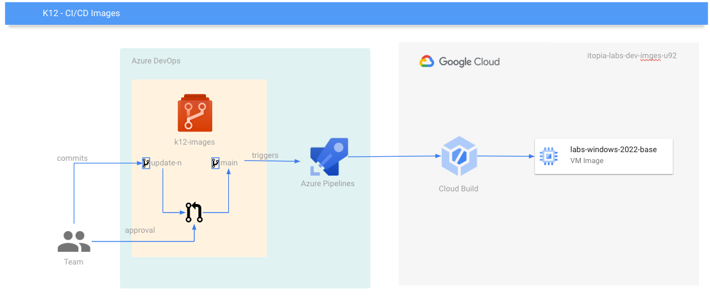

# K12 Images

This repo contains all the source code needed to build and release the Labs images.

## Build Image using Cloud Build

```bash
gcloud builds submit --substitutions=_PACKER_IMAGE="./images/classroom_2022_noapps"
```

The pipeline has this other optional parameter `_CUSTOM_SOURCE_IMAGE`.

```bash
# Example for use a custom source_image as base.
gcloud builds submit --substitutions=_PACKER_IMAGE="./images/classroom_2022_noapps",_CUSTOM_SOURCE_IMAGE=labs-windows-2022-base-20221203041227

# where `labs-windows-2022-base-20221203041227` is your custom source_image ID and has not been promoted to the HCP registry but needs to build an application image from it.
```

The following diagram shows the automated process of building the images. The pipeline that creates the image is executed in Azure DevOps and Cloud Build, using the Packer files and Powershell scripts versioned in this repository.



## Build Image using Packer from dev machine

Disable HCP Packer reporting, set an environment variable `HCP_PACKER_REGISTRY` to `OFF`.

```bash
export HCP_PACKER_REGISTRY="OFF"
```

Configure HCP Packer environment variables to get the base image from the HCP Packer feed.

```bash
export HCP_CLIENT_ID=[HCP_CLIENT_ID]
export HCP_CLIENT_SECRET=[HCP_CLIENT_SECRET]
```

Run Packer Init to to download Packer plugin binaries.

```bash
packer init image-creation/packer/labs_2022_noapps
```

Build the image using Packer

```bash
packer build  -var 'project_id=[PROJECT_ID]' -var 'zone=[ZONE]' image-creation/packer/labs_2022_noapps
```

NOTE: 
- Replace [PROJECT_ID] and [ZONE] with the project id and zone of the GCP project where the image will be built
- Replace [HCP_CLIENT_ID] and [HCP_CLIENT_SECRET] with the HCP Packer credentials.